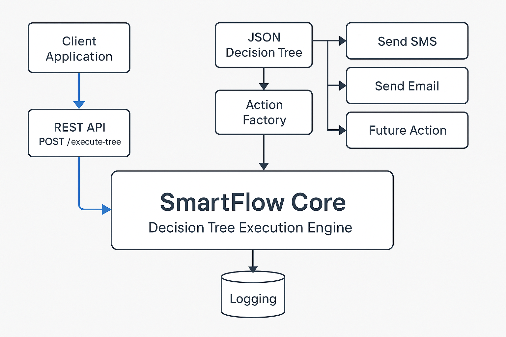
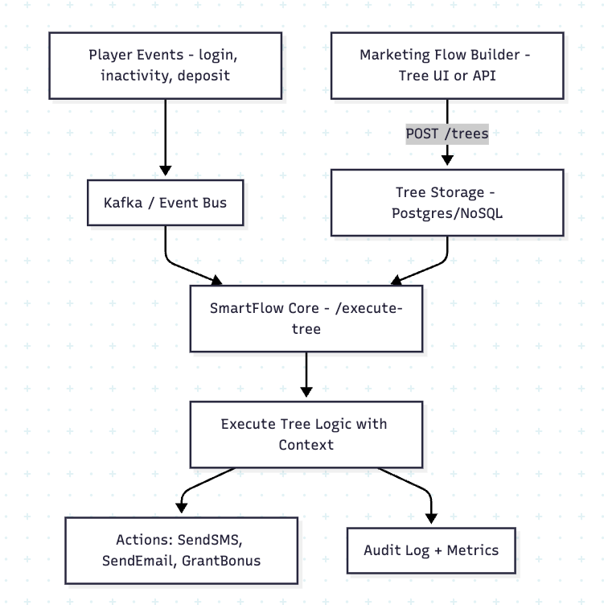

# System Design: SmartFlow Core

## 1. Executive Summary

SmartFlow Core is a real-time decision tree execution engine that empowers marketing and operations teams to define and execute player engagement workflows—without writing backend code or deploying new services. This enables real-time personalization, retention logic, and player-triggered automation in the iGaming domain.

---

## 2. Business Context

In modern iGaming platforms, player retention is driven by dynamic, contextual engagement: sending timely SMS, rewarding loyalty, and reactivating dormant players.

Traditionally, these campaigns required engineers to hardcode logic into the backend. SmartFlow Core shifts that responsibility to non-technical teams—while preserving auditability and performance.

SmartFlow Core enables:

- Business-defined decision trees (via JSON)
- Safe, real-time evaluation of player context
- Configurable actions like SendSMS, SendEmail, GrantBonus

> Example: Maria, a Gold Tier player, is inactive for 5 days.  
> The engine evaluates her context and executes a branch:  
> **SendSMS("Come back for a bonus!")**

---

## 3. System Goals & Alignment

| Goal                                | Mapped User Story |
|-------------------------------------|-------------------|
| Define logic without backend code   | User Story 1      |
| Execute personalized workflows      | User Story 2      |
| Add new actions without rewrites    | User Story 3      |
| Support extensibility and auditing  | User Story 4      |

---

## 4. Architecture Overview

This diagram shows the internal layers and responsibilities of the SmartFlow Core execution engine.



---

## 5. JSON Schema Design (Frontend Interop)

```json
{
  "type": "Condition",
  "parameters": {
    "expression": "daysInactive > 5"
  },
  "trueAction": {
    "type": "SendSMS",
    "parameters": {
      "phone": "+1234567890",
      "message": "We miss you!"
    }
  },
  "falseAction": {
    "type": "SendEmail",
    "parameters": {
      "from": "promo@game.com",
      "to": "maria@example.com",
      "subject": "New offers await!"
    }
  }
}
```

✅ This schema is frontend-safe, schema-validatable, and designed for use with low-code visual builders.

---

## 6. Execution Flow

1. `POST /execute-tree` receives a decision tree + context object.
2. JSON is deserialized into `Action` classes using `ActionFactory`.
3. Tree is recursively executed by `Executor`.
4. Conditions are safely evaluated with `filtrex`.
5. Each `Action` logs its behavior and outcome.
6. Response is returned with structured status.

---

## 7. Non-Functional Highlights

- ⚙️ **Extensible:** Add new actions via `implements Action` + registration
- 🔒 **Secure:** No `eval`, no `vm2`, safe expression parsing via `filtrex`
- 🚀 **Fast:** Execution time < 150ms typical
- 🔍 **Auditable:** All actions log in structured format (JSON)
- 🧱 **Resilient:** Errors are caught and logged; execution never crashes the service

---

## 8. Design Trade-Offs

| Decision Area  | Current Design               | Trade-Off / Rationale                      |
|----------------|------------------------------|--------------------------------------------|
| Execution Mode | Synchronous HTTP             | Simpler to integrate, less scalable than async |
| Storage        | No persistent tree store     | Tree reuse/versioning not supported (yet)  |
| Evaluation     | `filtrex` DSL                | Safer than JS eval, but limited syntax     |
| Observability  | Console logs only (for now)  | Can be upgraded to CloudWatch or ELK       |

---

## 9. Future Enhancements

- Tree persistence (via `treeId`)  
- Kafka-triggered executions from player events  
- Secure audit logs for compliance use cases  
- Metrics endpoint: `/metrics` for Prometheus-style scraping  
- Visual builder frontend for decision trees  
- Localization support (i18n)

---

## 10. System Flow in Production

This diagram shows how SmartFlow Core operates in a real-world iGaming environment—where player events trigger tree execution, and outcomes like SMS or Email are dynamically chosen.



---

### Real-World Roles

**Marketing / Ops**
- Design logic visually (or JSON)
- Publish via `POST /trees` or internal UI

**SmartFlow Core**
- Stores or receives tree JSON
- Executes with player context

**Event Bus**
- Triggers: `player.inactive`, `player.deposit`, etc.
- Routes to SmartFlow via Kafka / EventBridge / Redis Streams

**Persistence (optional, future)**
- Stores tree versions and metadata
- Enables reuse via `treeId`

---

## 11. Conclusion

SmartFlow Core is a production-grade backend engine that bridges the gap between marketing automation and backend engineering.

It enables non-technical teams to design decision trees. It empowers developers to extend logic safely. It allows businesses to move faster without compromising reliability.

Designed to serve as a **Decision-as-a-Service platform**, SmartFlow Core demonstrates:

- Clean separation of concerns
- Safety over speed (but without losing speed)
- Extensibility by design

It is deployable, testable, explainable—and ready for real-time games at scale.
